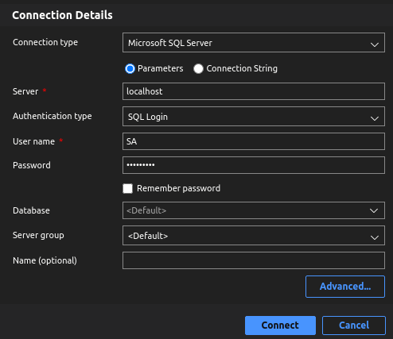

# Quickstart: run and connect SQL Server Linux container

* Pull the latest container image the from MS container registry:

```bash
sudo docker pull mcr.microsoft.com/mssql/server:2019-latest
```

* View images:

```bash
docker images
# docker image ls
```

* To run the Linux container image:

```bash
sudo docker run -e "ACCEPT_EULA=Y" -e "MSSQL_SA_PASSWORD=1q2w3e4R@" \
   -p 1433:1433 --name sql1 --hostname sql1 \
   -d \
   mcr.microsoft.com/mssql/server:2019-latest
```

`-e "ACCEPT_EULA=Y"`: accept end user licensing agreement

`-e "MSSQL_SA_PASSWORD=1q2w3e4r"`: set password for system admin (SA) user

`-p 1433:1433`: map a TCP port on the host environment with a TCP port in the container

`--name sql1`: specify a custom name for the container

`--hostname sql1`: set the container hostname

`-d`: run the container in the background

`mcr.microsoft.com/mssql/server:2019-latest`: the SQL Server linux container image

* To view Docker containers:


```bash
docker ps -a
```

* To debug container error (if any):

```bash
docker logs sql1
```

* To connect to SQL Server with `sqlcmd`, inside the container

```bash
sudo docker exec -it sql1 "bash"
/opt/mssql-tools/bin/sqlcmd -S localhost -U SA -P "1q2w3e4R@"
```

* To connect to SQL Server with Azure Studio:



* To end `sqlcmd` session:

```bash
quit
```

* To remove the container

```bash
sudo docker stop sql1
sudo docker rm sql1
```

# Restore a database from a backup file in a Linux Docker container

* Download AdventureWorks sample databases: [LINK](https://learn.microsoft.com/en-us/sql/samples/adventureworks-install-configure?view=sql-server-ver16&tabs=tsql)

* Check existence of backup folder:

```bash
sudo docker exec -it sql1 ls var/opt/mssql
```

* If not, create a new one:

```bash
sudo docker exec -it sql1 mkdir var/opt/mssql/backup
```

* Copy the backup file to the container

```bash
sudo docker cp AdventureWorks2019.bak sql1:/var/opt/mssql/backup
```

* Check existence of the backup file inside container folder

```bash
sudo docker exec -it sql1 ls var/opt/mssql/backup
```

* List out logical file names and paths inside the backup:

```bash
sudo docker exec -it sql1 /opt/mssql-tools/bin/sqlcmd \
   -S localhost -U SA -P '1q2w3e4R@' \
   -Q 'RESTORE FILELISTONLY FROM DISK = "/var/opt/mssql/backup/AdventureWorks2019.bak"'
```

* Restore database using `sqlcmd`:

```bash
sudo docker exec -it sql1 /opt/mssql-tools/bin/sqlcmd \
   -S localhost -U SA -P '1q2w3e4R@' \
   -Q 'RESTORE DATABASE [AdventureWorks2019] FROM DISK = "/var/opt/mssql/backup/AdventureWorks2019.bak" WITH MOVE "AdventureWorks2017" TO "/var/opt/mssql/data/AdventureWorks2019.mdf", MOVE "AdventureWorks2017_log" TO "/var/opt/mssql/data/AdventureWorks2019_log.ldf", FILE = 1,  NOUNLOAD,  STATS = 5'
```

* Verify the restored database:

```bash
sudo docker exec -it sql1 /opt/mssql-tools/bin/sqlcmd \
   -S localhost -U SA -P '1q2w3e4R@' \
   -Q 'SELECT Name FROM sys.Databases'
```

# References

* [Quickstart: Run SQL Server Linux container images with Docker](https://learn.microsoft.com/en-us/sql/linux/quickstart-install-connect-docker?view=sql-server-ver16&pivots=cs1-bash)

